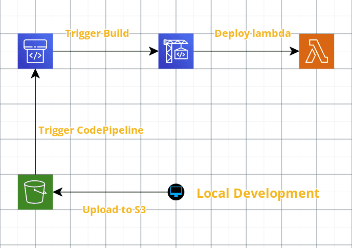

# CI/CD for aws lambda


[](https://github.com/simorgh1/lambda-cd/blob/master/LICENSE)
[](https://github.com/simorgh1/lambda-cd/stargazers)


Stargaze  if you find it useful.

CodePipeline CI/CD template and build script for a sample aws lambda application.

### Working in Dev Container

Sample lambda application was created by [serverless framework](https://www.serverless.com) and python3. CodePipeline is a managed aws ci/cd service and the corresponding cloudformation template is applied using aws cli.

This tools are already pre-installed in the [development container](https://microsoft.github.io/code-with-engineering-playbook/developer-experience/devcontainers/), which could be used in vscode:

- Python3
- Serverless framework
- Aws Cli v2
- Make

### Requirements

- **Visual Code** [install](https://code.visualstudio.com/Download)
- **Docker** [install](https://docs.docker.com/engine/install/)
- **AWS [account](https://aws.amazon.com)**

### Getting started

After cloning this repository, open the folder in vscode, it will prompt you to open it inside the configured Dev Container. First startup will take a little longer since the docker container image needs to be built, then inside the vscode, open a terminal in the project working folder.

### CI/CD Workflow



After [configuring](https://docs.aws.amazon.com/cli/latest/userguide/cli-configure-quickstart.html) the aws cli with the valid credentials, create the ci/cd pipeline.

### Creating the Pipeline

IaC is located in **.cf** folder, where a cloudformation template describing the required resources for building the pipeline is stored. A Makefile, simplifies the build process here as well, open a terminal in this folder and run:

```bash
.cf/: make create
```

There are also update and remove targets defined for upcoming updates in the pipeline or for cleaning up of the created resources at the end.

### Starting the Pipeline

For starting the pipeline, switch to the **app** folder, which is a hello-world lambda function written in python3 using serverless framework. Then run the upload command, which will copy all required artifacts to the defined s3 source bucket, this will then trigger the pipeline that deploys the lambda function.

```bash
app/: make upload
```

For smoke testing of hello function, it is invoked after deployment in build stage and the corresponding logs are printed.

### CodePipeline Cleanup

All resources are created using a cloudformation template, for cleaning up, the created stack must be deleted. Keep in mind that not empty S3 buckets must be deleted manually. For detailed information visit the cloudformation stack **codepipeline-lambda** in your configured region.

```bash
.cf/: make remove
```

### Sample Lambda app Cleanup

Lambda application also required some resources, which needs to be cleanup at the end, please check cloudwatch logs.

```bash
app/: make remove
```

### Feedback

If you have any questions using the ci/cd pipeline for lambda, contact me by my twitter/linkedin provided above.
